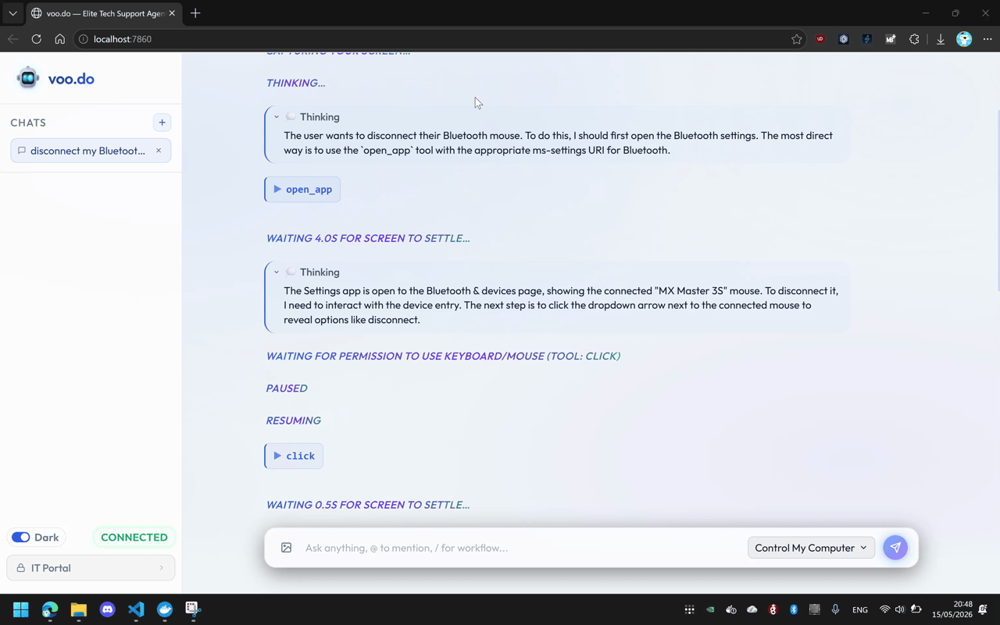
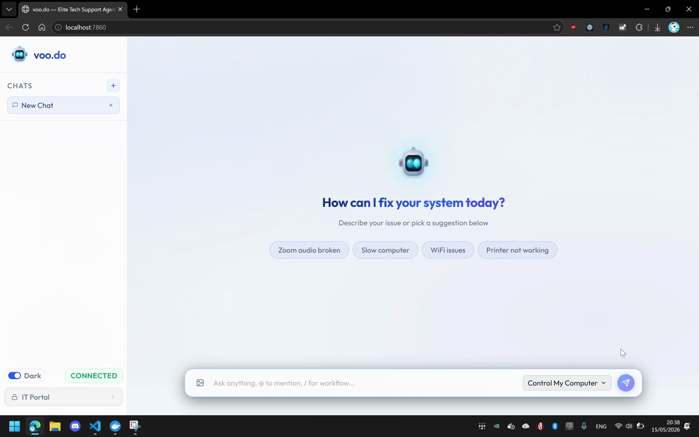
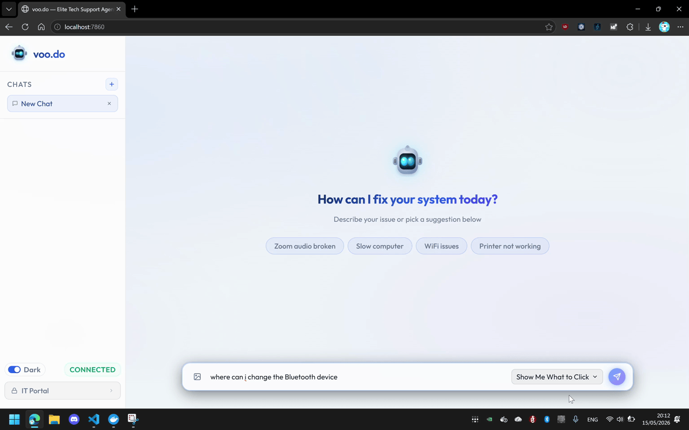
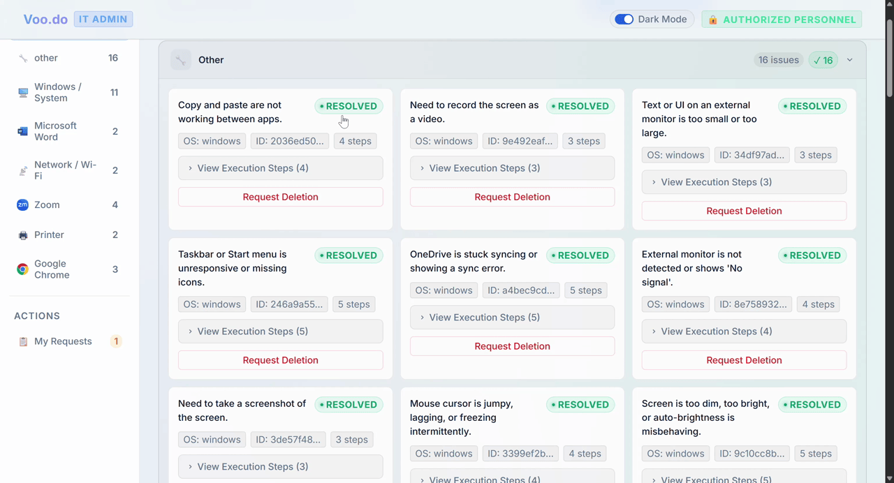

# 🤖 VooDo — Autonomous AI Tech Support Agent

> **An AI agent that sees your screen, reasons about your problem, and fixes it autonomously — like a remote IT technician that is instant, free, and available 24/7.**



---

## 🏆 Project Submission Overview

**The Problem:** Tech support queues take hours. Existing chatbots only tell you *how* to fix a problem, forcing you to follow confusing step-by-step tutorials. 

**The Solution:** VooDo uses vision-language models (like Gemini) to actually *do the work*. You describe the problem, the agent takes a screenshot, reasons about the UI state, and controls your mouse and keyboard to fix it autonomously.

**Key Innovation:** Unlike simple macro scripts, VooDo is a closed-loop system: `screenshot → reason → act → screenshot`. It verifies every action before taking the next one, making it incredibly robust.

---

## 🎥 Demos

| Control Mode | Guide Mode | Solutions DB |
|---|---|---|
|  |  |  |
| Agent clicks & types for you | Agent highlights where to click | Shared knowledge base for repeat fixes |

---

## 🚀 Key Features

### 1. Real Computer Vision
The agent takes a screenshot before **every single action**. It never assumes what's on screen — it always verifies, just like a human technician.

### 2. Autonomous Multi-Step Loop
The agent can execute workflows up to 15 steps long, checking the result of each action before proceeding.

### 3. Two Operating Modes
- **Control Mode** — The agent fully resolves the issue. Each mouse/keyboard action requires your approval first.
- **Guide Mode** — The agent never touches your machine. Instead, it annotates your screen with spotlight overlays, teaching you exactly where to click.

### 4. Semantic Cache (Speed Optimization)
Solved problems are stored as **384-dimensional semantic embeddings** in a Postgres database using `pgvector`. When a similar issue comes in, the agent skips the reasoning phase and finds the cached fix instantly, reducing a 45-second fix to 5 seconds.

### 5. Enterprise-Grade Security
- **Hard Tool Allow-list:** Deny-by-default logic; only 40+ safe tools permitted.
- **Dangerous Key Blocklist:** System hotkeys (Win+R, Ctrl+Alt+Delete) are permanently blocked.
- **Per-Session Caps:** Max 5 destructive actions and 500 characters typed per session to prevent runaway loops.
- **Prompt Injection Defense:** Scans and strips invisible Unicode characters used by attackers.

### 6. Firewall-Friendly Architecture
The Windows executor **dials out** to the backend over WebSocket. Zero inbound ports are needed, meaning it works out-of-the-box behind corporate firewalls and NATs.

---

## 🏗️ Architecture

```
┌─ Backend (FastAPI) ─────────────────┐     ┌─ Windows Machine ────────┐
│                                     │     │                          │
│  Agent Loop + Chat UI   :7860       │◀─WS─│  VooDo Executor          │
│  Postgres + pgvector    :5432       │     │  pyautogui / mss         │
│                                     │     │  user's screen           │
└────────┬────────────────────────────┘     └──────────────────────────┘
         ▼
   LLM API (Gemini / OpenAI / OpenRouter)
```

---

## ⚡ Quickstart Guide

### Prerequisites
- Python 3.10+
- A Gemini / OpenAI API key

### 1. Clone & Configure

```bash
git clone https://github.com/anirbandutta-dev/Ai-agent.git
cd Ai-agent
```

Create a `.env` file in the root directory:

```env
# Using Gemini
LLM_BASE_URL=https://generativelanguage.googleapis.com/v1beta/openai/
LLM_API_KEY=your-api-key-here
LLM_MODEL=gemini-flash-lite-latest

# Core Settings
SKIP_DB=1 # Set to 0 if you have Postgres running via Docker
EXECUTOR_TOKEN=hackathon123
IT_PASSWORD=demo123
ADMIN_PASSWORD=demo123
```

### 2. Start the Backend Server

```bash
pip install -r server/app/requirements.txt -r server/agent/requirements.txt
python -m uvicorn server.app.main:app --host 0.0.0.0 --port 7860
```

### 3. Start the Windows Executor

```powershell
.\client\scripts\dev_all.ps1 -Backend "ws://localhost:7860" -Token "hackathon123"
```

### 4. Run It!
Go to **http://localhost:7860** in your browser. Type *"My Bluetooth is not working"* and watch the agent take over.

---

## 🧪 Test Prompts to Try
- *"My Bluetooth is not working"*
- *"Open Notepad and write Hello World"*
- *"Check my disk space"*
- *"My WiFi keeps disconnecting"*
- *"Set my volume to 50%"*

---

## 🤝 Built With
- **[FastAPI](https://fastapi.tiangolo.com/)** — Backend & WebSocket server
- **[pyautogui](https://pyautogui.readthedocs.io/)** — Mouse & keyboard control
- **[mss](https://python-mss.readthedocs.io/)** — Lightning-fast screen capture
- **[pgvector](https://github.com/pgvector/pgvector)** — Semantic solution caching
- **[Gemini AI](https://ai.google.dev/)** — Vision-language reasoning model

---

## 📄 License
MIT License — feel free to use, modify, and build on this project.